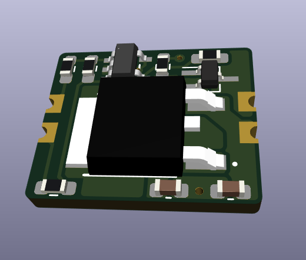
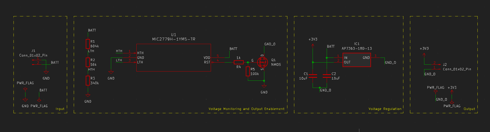

# Battery Regulator Module (N-FET Version)

Custom lithium-polymer battery voltage monitor and regulator module (N-FET version).

## Overview

This custom module is designed as a drop-in for small-scale electronics projects providing 3.3V linear regulated voltage output from a raw lithium polymer cell input. The battery input voltage is monitored by the [MIC2779](https://www.digikey.com/en/products/detail/microchip-technology/MIC2779L-2YM5-TR/1616864) whose output enables or disables the regulated output supply. It is configured with hysteresis to cutoff output when the battery voltage reaches 3.1V and to then hold in reset until the battery voltage exceeds 3.6V.

This is a form-factor-compatible replacement for the battery regulator module design available [here](). This version makes use of an N-FET transistor for switching rather than the built-in enable used in the original design. This version is meant to serve as a alternate to be used on the basis of parts-available.

The module supports the 1.5A maximum current limitations of the regulator chip [AP7363](https://www.digikey.com/en/products/detail/diodes-incorporated/AP7363-33D-13/3829401) used.

This module may be combined with a Lipo charger module such as the [TP4056](https://www.best-microcontroller-projects.com/tp4056.html) (along with any in-circuit charging mods as required) for a complete custom battery charging/monitoring/regulation for small-scale electronics projects.

## Schematic

The schematic for the circuit is provided below as designed in Kicad 7.

## License

MIT © 2024 John Greenwell